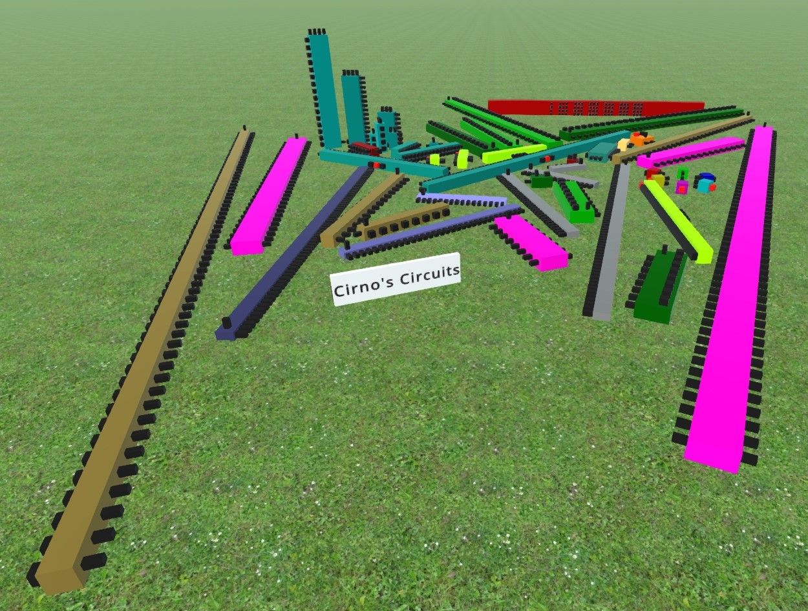

# Cirno's Circuits (V0.4.5)

A mod for Logic World (v0.92 Preview).
A random assortment of parts and logic.

## Includes:

- Multiplexers
- Decoders
- Ascii to 5x7 matrix
	
	- 7 bit ascii value (first 32 are blank)
	- 3 bit row selector (runs top down, 1 to 7, 0 is always blank)

- Sideways Logic Gates!
- Big Relays
- Big D-Latches
- D-Flip Flops
- Comparators
- BCD to binary Converter (19 digits to 64 bits)
- Edge Detector (Rising and Falling)
- JK Flip-Flop
- SR-Latch
- Integer and Float Printers
- 8, 16, and 32 Bit Adders
- 8, 16, and 32 Bit Multipliers
- 8, 16, and 32 Bit Dividers
- De-Multiplexers
- Counters

## Future Plans

- Binary to BCD 7 segment with ripple blanking and negative support
- Binary to Fractional BCD (fixed point values from 0.0000... to 0.9999...)
- Pulse Extender
- Thinner switches
- 14 and 16 segment displays
- Text input to Binary (type in "42", output 101010)

## Install

Make sure any older version of Cirno's Circuits is removed
To install the mod, Download the ZIP file below. Copy the folder called "Cirno's Circuits" and paste it in your GameData folder
